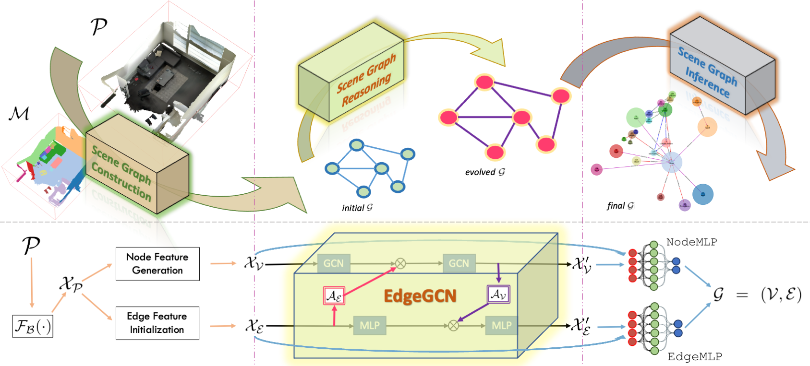

# SGG<sub>point</sub>

This repository contains a PyTorch implementation of the following paper:

> **Exploiting Edge-Oriented Reasoning for 3D Point-based Scene Graph Analysis**
>
> [Chaoyi Zhang](https://chaoyivision.github.io/), Jianhui Yu, [Yang Song](http://www.cse.unsw.edu.au/~ysong/), [Weidong Cai](https://www.sydney.edu.au/engineering/about/our-people/academic-staff/tom-cai.html)
>
> CVPR 2021
>
> **Abstract** Scene understanding is a critical problem in computer vision. In this paper, we propose a 3D point-based scene graph generation (<b>SGG<sub>point</sub></b>) framework to effectively bridge perception and reasoning to achieve scene understanding via three sequential stages, namely scene graph construction, reasoning, and inference. Within the reasoning stage, an EDGE-oriented Graph Convolutional Network (<b>EdgeGCN</b>) is created to exploit multi-dimensional edge features for explicit relationship modeling, together with the exploration of two associated twinning interaction mechanisms between nodes and edges for the independent evolution of scene graph representations. Overall, our integrated SGG<sub>point</sub> framework is established to seek and infer scene structures of interest from both real-world and synthetic 3D point-based scenes. Our experimental results show promising edge-oriented reasoning effects on scene graph generation studies. We also demonstrate our method advantage on several traditional graph representation learning benchmark datasets, including the node-wise classification on citation networks and whole-graph recognition problems for molecular analysis.
>
> [[Project page]](https://SGGpoint.github.io/) [[Arxiv]](https://arxiv.org/pdf/2103.05558.pdf) [[Supp.]](https://sggpoint.github.io/supplementary.pdf) [[Video]](https://sggpoint.github.io/#video)



Figure. Our proposed 3D point-based scene graph generation (SGG<sub>point</sub>) framework consisting of three sequential stages, namely, scene graph construction, reasoning, and inference.

## Dataset

A quick glance at some features of our cleaned <b>3DSSG-<font color="red">O27</font><font color="blue">R16</font></b> dataset (compared to the original 3DSSG dataset):
* dense point cloud representation with color and normal vector info. encoded - see [Sec. A - Point Cloud Sampling](https://chaoyivision.github.io/SGGpoint/#a-point-cloud-sampling);
* with same scene-level split applied on 3DSSG - but with <i>FullScenes (i.e., original graphs)</i> instead of SubScenes (subgraphs of 4-9 nodes in 3DSSG);
* with small / partial scenes of low quality excluded - see [this list](http://campar.in.tum.de/files/3RScan/partial.txt) (officially announced in 3DSSG's [FAQ Page](https://github.com/WaldJohannaU/3RScan/blob/master/FAQ.md#some-scenes-in-3rscan-seem-to-be-quite-small--partial-whys-that));
* with object-level class imbalance alleviated - see [Sec. B1 - Node (object) Remapping](https://chaoyivision.github.io/SGGpoint/#b-updates-on-scene-graph-annotations);
* with edge-wise comparative relationships (e.g., `more-comfortable-than`) filtered out - we focus on <i>structural relationships</i> instead;
* reformulate the edge predictions from a multi-label classification problem to a multi-class one - see [Sec. B2 - Edge (Relationship) Relabelling](https://chaoyivision.github.io/SGGpoint/#b-updates-on-scene-graph-annotations);

To obtain our preprocessed <b>3DSSG-<font color="red">O27</font><font color="blue">R16</font></b> dataset, please follow the [instructions](https://sggpoint.github.io/#dataset) in our project page - or you could also derive these preprocessed data yourselves by following this step-by-step [preprocessing guidance](https://chaoyivision.github.io/SGGpoint/#dataset-preprocessing). 

## Code 

This repo. also contains Pytorch implementation of the following modules:
- [x] Preprocessing A: [10dimPoints](https://chaoyivision.github.io/SGGpoint/#a-point-cloud-sampling) & [batch script](https://github.com/chaoyivision/SGGpoint/blob/main/preprocessing/point_cloud_sampling.bash);
- [ ] Preprocessing B: [SceneGraphAnnotation.json](https://chaoyivision.github.io/SGGpoint/#b-updates-on-scene-graph-annotations) & Prep. Script;
- [x] dataloader's instructions (might be updated later [here](https://chaoyivision.github.io/SGGpoint/#last-few-steps));
- [ ] Backbone.py: PointNet / DGCNN / Tails;
- [ ] EdgeGCN.py;

**code coming soon, stay tuned!**

## Citation

If you find our data or project useful in your research, please cite:

```
@inproceedings{SGGpoint,
    title = {Exploiting Edge-Oriented Reasoning for 3D Point-based Scene Graph Analysis},
    author = {Zhang, Chaoyi and Yu, Jianhui and Song, Yang and Cai, Weidong},
    booktitle = {IEEE Conference on Computer Vision and Pattern Recognition (CVPR)},
    year = {2021}
}
```
#### Acknowledgments
This repo. template was borrowed from [Yang Zhou's Project](https://github.com/yzhou359/3DIndoor-SceneGraphNet).