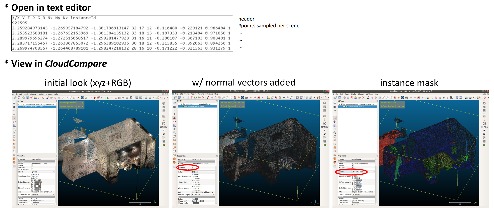

> Exploiting Edge-Oriented Reasoning for 3D Point-based Scene Graph Analysis (CVPR2021)
> 
> [[Project page]](https://SGGpoint.github.io/) [[Repo. page]](https://github.com/chaoyivision/SGGpoint) [[Arxiv]](https://arxiv.org/pdf/2103.05558.pdf) [[Supp.]](https://sggpoint.github.io/supplementary.pdf) [[Video]](https://sggpoint.github.io/#video)

## Dataset Description
For our real-world SGG<sub>point</sub> studies, we manually checked and carefully revised the raw [3DSSG](https://3dssg.github.io/) datasets (extended from [3RScan](https://waldjohannau.github.io/RIO/)) to a cleaned version (<b>3DSSG-<font color="red">O27</font><font color="blue">R16</font></b>), with mappings to more popular and meaningful sets of instance semantics & structural relationships. <b>3DSSG-<font color="red">O27</font><font color="blue">R16</font></b> stands for the preprocessed 3DSSG dataset annotated with <font color="red"><b>27 O</b>bject classes</font> and <font color="blue"><b>16</b> types of structural <b>R</b>elationships</font> - please refer to our [[Supp.]](https://sggpoint.github.io/supplementary.pdf) for more info.

To download our preprocessed <b>3DSSG-<font color="red">O27</font><font color="blue">R16</font></b> dataset, please follow the [instructions](https://sggpoint.github.io/#dataset) in our project page - or you could also derive these preprocessed data yourselves by following the step-by-step guidance below. 

<b>Structure of our 3DSSG-O27R16.</b> There are mainly two kinds of files in our dataset, namely the dense 10-dim point cloud representitaons (<font color='green'><b>"<u>10dimPoints</u>"</b></font>) and our updated scene graph annotations (<font color='green'><b>"<u>SceneGraphAnnotation.json</u>"</b></font>). The dict structure of SceneGraphAnnotation.json will be summarized here when we have it avaiable soon. 

## Dataset Preprocessing
Below we would go through and explain each preprocessing step in generating our <b>3DSSG-<font color="red">O27</font><font color="blue">R16</font></b> dataset (for your information and interests only):

### A. <b>Point Cloud Sampling</b>
<i>sampling 10-dim point cloud from obj files with mesh info. discarded</i>.
    
1. [CloudCompare](http://www.cloudcompare.org/) software is adopted for sampling dense point cloud representations (PC<sub>9-dim</sub>) for scenes encoded within the raw <u>mesh.refined.obj</u> files. The [surface density](https://www.cloudcompare.org/doc/wiki/index.php?title=Mesh%5CSample_points) was set to 10k points per square unit, and the generated point clouds are of 9-dim (3-dim coordinate, 3-dim color, and 3-dim normal vector). Our corresponding batch sampling script is available in "preprocessing" folder under this repository.
2. Fetch a relatively sparse point cloud instance mask (IM<sub>4-dim</sub>) (with per-point instance_idx annotation) from the raw <u>labels.instances.annotated.ply</u> files.
3. Overlap IM<sub>4-dim</sub> to PC<sub>9-dim</sub> to generate the desired <b>10-dim dense point cloud representations</b>, including the information of 3-dim coordinate (x, y, z), 3-dim color (R, G, B), 3-dim normal vector (Nx, Ny, Nz), and 1-dim instance_idx. Specifically, the instance annotation for each point from PC<sub>9-dim</sub> is decidied as the corresponding annotation of its nearest point from IM<sub>4-dim</sub>. These outputs are saved as <font color='green'><b>"<u>10dimPoints/[Scene_IDx].txt</u>"</b></font> in our <b>3DSSG-<font color="red">O27</font><font color="blue">R16</font></b> dataset.
4. Some quick demo.
 <!-- .element width="100%" -->

### B. <b>Updates on Scene Graph Annotations</b>
<i>full lists of remapped & relabelled annotations can be found in </i> our [[Supp.]](https://sggpoint.github.io/supplementary.pdf).
   1. <b>Node (object) Remapping</b>: Remap raw object classes into their another popular 27-class set ([RIO27](https://github.com/WaldJohannaU/3RScan/blob/master/data/mapping.txt)). Note: there exist 28 unique ID-Label pairs under the [["RIO27 Mapping" coloum]](https://docs.google.com/spreadsheets/d/1eRTJ2M9OHz7ypXfYD-KTR1AIT-CrVLmhJf8mxgVZWnI/edit?usp=sharing), including an unexpected `"0 : -"` annotation - which contains a few rare objects such as `juicer`, `hand dryer`, `baby bed`, and `cosmetics kit`. As the handling of data imbalance is out of our scope of focus, we would treat them as <font color="purple"><i><b>invalid objects</b></i></font> under our task context in <i>Recalibration Step</i> below.
   2. <b>Edge (Relationship) Relabelling</b>: The raw semi-automatically generated 3DSSG dataset is a mix beween semi-automatic computation and manual annotation. To improve edge-level annotation quality, we manually checked and corrected through following sub-steps to derive a multi-class label set <i>(rather than a multi-label set)</i> of meaningful structure relationships:
         1. We firstly remove all comparative annotations (e.g., `big1ger-than`, `same-material`, and `more-comfortable-than`) to focus more on the structural relationships (e.g., `standing-on`, `leaning-against`), resulting in a 19-class label set.
         2. We aggregate four directional proximity relationships (namely, `left`, `right`, `behind`, and `front` - which could be easily decided by the bbox centers in post-processing we suppose) into one NEW type named as `Spatial Proximity`. This aggregation addresses ill-posed orientation-variant observations on inter-object relationships (and therefore, releases the power of rotation-involved data augmentation techniques), resulting in a 16-class label set now. <br>
            <font color="gray">* Recall from 3DSSG: these directional proximity relationships are only considered and annotated between the nodes that share a support parent => The same condition applies to our `Spatial Proximity` now.</font>
         3. We then notice the majority (nearly 80%) of edge annotation is under multi-class setting already, while the resting multi-label edges mainly conflict to the ambiguous `close-by` annotation. After a careful study, we managed to produce a multi-class label set through strategies below. <b>TL;NR: we re-defined `close-by`<sup>1</sup> and `Spatial Proximity`<sup>2</sup> relations, such that a priority list of interests can be retained as "`?` > `Spatial Proximity` > `close-by`".</b> <font color="gray"> 
            <br> Let `?` denotes any other labels except for `Spatial Proximity` and `close-by`, such as `connected-to`, `standing-on`, and `attached-to`. </font>
          
             | All Cases (Ratio) | Descriptions | Solution w/ Explanation
             | :--- | :--- | :--- 
             | Normal (79.4%) | [`Spatial Proximity`] or [`close-by`] or [`?`] | <b>N/A.</b> Within expected multi-class setting already, i.e., 1 label per edge.
             | Case 1 (20.5%) | [`close-by`, `Spatial Proximity`] (20.4%) or [`close-by`, `?`] (0.1%)  | <b>Relabel Case 1 by the removal of `close-by`.</b> Ignoring `close-by` as long as there exists a more meaningful and specific structural relationship.<sup><b>1</b></sup> 
             | Case 2 (0.001%) | [`Spatial Proximity`, `?`] | <b>Relabel Case 2 as `?`.</b> For these very rare cases where two objects share one support parent (`Spatial Proximity`) <u>AND</u> they also have another mearningful relation (`?`), we'd like to focus more on the higher-level one.<sup><b>2</b></sup> 
             | Case 3 (0.04%) | [`Spatial Proximity`, `close-by`, `?`] | <b>Relabel Case 3 as `?`.</b> Merging from Case 1 & 2 above.
       
             <sup><b>1</b></sup>In other words, `close-by` (after relabelling) is now describing the relationship between two objects who are spatially close to each other <u>AND</u> they have no extra high-level structural relationships including `Spatial Proximity`.<br>
             <sup><b>2</b></sup>`Spatial Proximity`(after relabelling) - two objects have a spatial relationship (among `left`, `right`, `behind`, and `front`) with each other <u>AND</u> they share a support parent <u>AND</u> they have no higher-level relations (`?`) in between.
         4. Now we derive a multi-class structural relationship set for edge predictions.
       
   3. <b>Recallibraition between node and edge annotations simultaneously.</b> 1) Remove all edges connected to <font color="purple"><i><b>invalid nodes</b></i></font>. 2) Iterate among edges, find the isolated nodes (with no edges connected to) for each scene, and remove them as well. Our scene graph annotations derived after this step are saved as <font color='green'><b>"<u>SceneGraphAnnotation.json</u>"</b></font> in our 3DSSG-O27R16 dataset.

## Last Few Steps
<i>Within dataloader.py</i> 

* <b>Filtering out the point cloud instances</b> with no matches found in cleaned Scene Graph annotations above. Apart from being compatible to our changes above, this step would also fix a few inperfect annotating issues (e.g., some instances only appear in the scenes but missing in scene graph annotation) within the raw 3DSSG. <br>
    * Below is some pseudo-code for REMOVING invalid & mismatched nodes from pointclouds
        ```python
        for each scene in scene_data:
            # split pointcloud (9-dim) and instance_idx (1-dim) from the 10dimPoints file
            unique_instance_idx_in_pointcloud = set(np.unique(instance_idx))
            # suppose unique_instance_idx_in_scenegraph denotes the unique ids per scene from SceneGraphAnnotation file 
            
            diff = list(unique_instance_idx_in_pointcloud.difference(unique_instance_idx_in_scenegraph)) # ignore the mismatched instances
            num_invalid_node = np.sum(instance_idx <= 0)                                                 # ignore the invalid nodes
            if len(diff) > 0 or num_invalid_node > 0:
                valid_index = (instance_idx > 0)                      # ignore the invalid nodes
                for diff_value in diff:                               # ignore the mismatched instances
                    curr_valid_index = (instance_idx != diff_value)
                    valid_index *= curr_valid_index
                pointcloud = pointcloud[valid_index]
                instance_idx = instance_idx[valid_index]
                # print('after :', instance_idx.shape, pointcloud.shape, valid_index.shape) # uncomment if you'd like to check the point_num chanages
      
            # DESIRED OUTPUTS now: pointcloud & instance_idx
        ```
    * Below is some pseudo-code for CHECKING invalid & mismatched nodes in pointclouds
        ```python
        diff1 = unique_instance_idx_in_scenegraph.difference(unique_instance_idx_in_pointcloud)
        diff2 = unique_instance_idx_in_pointcloud.difference(unique_instance_idx_in_scenegraph)
        assert len(diff1) == len(diff2) == 0, "Something wrong: {}- \n{} - \n{}".format(scene_name, unique_instance_idx_in_pointcloud, unique_instance_idx_in_scenegraph)
        ```

* <b>Data augmentation - random sampling constant number of (4096) points for each scene of larger size.</b> To ensure a uniform sampling effects achieved among objects, we compute a dynamic sampling_ratio for each scene of different size - and use it to achieve cropping_by_instance_idx to guarantee that all objects could be fairly sampled each loading time (without the influences caused by object scale differences). See [[Supp.]](https://sggpoint.github.io/supplementary.pdf) for more relevant details.
    
    ```python
    def cropping_by_instance_idx(self, instance_labels):
        # instance_labels is the 1-dim instance_idx above.
        if instance_labels.shape[0] > self.max_npoint:          # self.max_npoint is set to 4096
            sampling_ratio = self.max_npoint / instance_labels.shape[0]
            all_idxs = []                                       # scene-level instance_idx of points being selected this time
            for iid in np.unique(instance_labels):              # sample points on object-level
                indices = (instance_labels == iid).nonzero()[0]     # locate these points of a specific instance_idx
                end = int(sampling_ratio * len(indices)) + 1        # num_of_points_to_be_sampled + 1
                np.random.shuffle(indices)                          # uniform sampling among each object instance
                selected_indices = indices[ :end]                   # get the LuckyPoints that get selected in fortune's favourite
                all_idxs.extend(selected_indices)                   # append them to the scene-level list
            valid_idxs = np.array(all_idxs)
        else:
            valid_idxs = np.ones(instance_labels.shape, dtype=bool) # no sampling is required
        return valid_idxs
    
    # somewhere in dataloader 
    _valid_idxs_ = self.cropping_by_instance_idx(instance_labels)
    # 10dimPoints = xyz + rgb + normal + instance_idx (semantic_labels are fetched from searching instance_idx within SceneGraphAnnotation)
    xyz = xyz[_valid_idxs_]
    rgb = rgb[_valid_idxs_]
    normal = normal[_valid_idxs_]
    semantic_labels = semantic_labels[_valid_idxs_]
    instance_labels = instance_labels[_valid_idxs_]
    ```
* <b>Data augmentation - other operations on point cloud representations.</b> Borrowed from [PointGroup](https://github.com/Jia-Research-Lab/PointGroup/blob/a41c2cd22808861f0d4986b2825875c10bb661e5/data/scannetv2_inst.py#L121).
* <b>Reordering instance_idx per batch.</b> In our PyTorch (and [torch_geometric](https://pytorch-geometric.readthedocs.io/en/latest/)) implementations, we achieved the batch training (on varying num_node graphs) by <u>aggregating these individual scene graphs into one big but isolated graph</u>. 
    * For example, given a batch_size B > 1, we have B scene graphs with varying number of nodes per each batch (say, their node_num as N<sub>1</sub>, N<sub>2</sub>, ..., N<sub>B</sub>), we could simply aggregate them into 1 big graph containing B isolated sub-graphs.
    * These isolated sub-graphs would not mess with others in the following node/edge propagations, which could be guaranteed by reordering their instance_idx to a `range` list of length (N<sub>1</sub> + N<sub>2</sub> + ... + N<sub>B</sub>).
    * This mapping (old instance_idx -> reordered instance_idx) is globally shared among each batch. Note: this instance_idx reordering operation also need to be applied on the edges.
